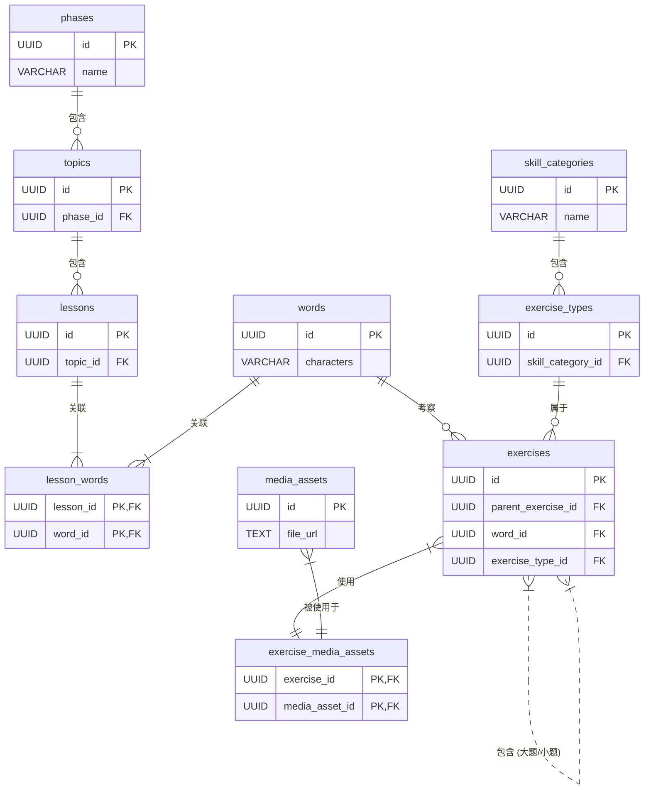

- **数据库系统**: PostgreSQL  
- **Schema**: `content_new`  
- **主键策略**: 全部使用 `UUID`  

---

## 1. 实体关系图 (ERD)

下图展示了数据库中所有核心表之间的关系。

- `||--o{` 表示“一对多”关系
- `||--|{` 和 `}--||` 表示通过连接表实现的“多对多”关系
- `}|..|{` 表示自引用的“一对多”关系（父子关系）

------

## 2. 表定义详情

### 2.1 `phases` - 学习阶段表

存储最高层级的学习阶段，例如：初级、中级、高级。

| 列名          | 类型         | 约束                            | 描述                |
| ------------- | ------------ | ------------------------------- | ------------------- |
| id            | UUID         | PK, DEFAULT `gen_random_uuid()` | 唯一标识符          |
| name          | VARCHAR(255) | NOT NULL, UNIQUE                | 阶段名称，如 "初级" |
| display_order | INT          | NOT NULL, UNIQUE                | 阶段的显示顺序      |
| created_at    | TIMESTAMPTZ  | NOT NULL, DEFAULT `NOW()`       | 创建时间            |
| updated_at    | TIMESTAMPTZ  | NOT NULL, DEFAULT `NOW()`       | 最后更新时间        |

------

### 2.2 `topics` - 主题表

每个主题属于一个学习阶段，例如“问候”、“家庭”等。

| 列名         | 类型                           | 约束                            | 描述                   |
| ------------ | ------------------------------ | ------------------------------- | ---------------------- |
| id           | UUID                           | PK, DEFAULT `gen_random_uuid()` | 唯一标识符             |
| phase_id     | UUID                           | FK → `phases.id`, NOT NULL      | 关联的学习阶段ID       |
| topic_name   | VARCHAR(255)                   | NOT NULL                        | 主题名称               |
| topic_order  | INT                            | NOT NULL                        | 主题在所属阶段中的序号 |
| created_at   | TIMESTAMPTZ                    | NOT NULL, DEFAULT `NOW()`       | 创建时间               |
| updated_at   | TIMESTAMPTZ                    | NOT NULL, DEFAULT `NOW()`       | 最后更新时间           |
| **复合约束** | UNIQUE (phase_id, topic_order) | 确保同一阶段内主题序号唯一      |                        |

------

### 2.3 `lessons` - 课程表

每个课程属于一个主题，是学习的基本单元。

| 列名          | 类型                             | 约束                            | 描述                   |
| ------------- | -------------------------------- | ------------------------------- | ---------------------- |
| id            | UUID                             | PK, DEFAULT `gen_random_uuid()` | 唯一标识符             |
| topic_id      | UUID                             | FK → `topics.id`, NOT NULL      | 关联的主题ID           |
| lesson_name   | VARCHAR(255)                     | NOT NULL                        | 课程名称               |
| display_order | INT                              | NOT NULL                        | 课程在所属主题中的顺序 |
| created_at    | TIMESTAMPTZ                      | NOT NULL, DEFAULT `NOW()`       | 创建时间               |
| updated_at    | TIMESTAMPTZ                      | NOT NULL, DEFAULT `NOW()`       | 最后更新时间           |
| **复合约束**  | UNIQUE (topic_id, display_order) | 确保同一主题内课程顺序唯一      |                        |

------

### 2.4 `words` - 中心词库表

| 列名        | 类型         | 约束                            | 描述               |
| ----------- | ------------ | ------------------------------- | ------------------ |
| id          | UUID         | PK, DEFAULT `gen_random_uuid()` | 唯一标识符         |
| characters  | VARCHAR(100) | NOT NULL, UNIQUE                | 词语的汉字         |
| pinyin      | VARCHAR(255) |                                 | 拼音               |
| translation | TEXT         |                                 | 中文释义或外语翻译 |
| hsk_level   | SMALLINT     |                                 | HSK等级            |
| created_at  | TIMESTAMPTZ  | NOT NULL, DEFAULT `NOW()`       | 创建时间           |
| updated_at  | TIMESTAMPTZ  | NOT NULL, DEFAULT `NOW()`       | 最后更新时间       |

------

### 2.5 `lesson_words` - 课程与词语关联表

实现 `lessons` 和 `words` 的多对多关系。

| 列名          | 类型 | 约束                              | 描述           |
| ------------- | ---- | --------------------------------- | -------------- |
| lesson_id     | UUID | PK (Composite), FK → `lessons.id` | 课程ID         |
| word_id       | UUID | PK (Composite), FK → `words.id`   | 词语ID         |
| display_order | INT  | NOT NULL                          | 在课程中的顺序 |

------

### 2.6 `skill_categories` - 技能大类表

| 列名          | 类型        | 约束                            | 描述                |
| ------------- | ----------- | ------------------------------- | ------------------- |
| id            | UUID        | PK, DEFAULT `gen_random_uuid()` | 唯一标识符          |
| name          | VARCHAR(50) | NOT NULL, UNIQUE                | 技能名称，如 '听力' |
| description   | TEXT        |                                 | 描述信息            |
| display_order | INT         | NOT NULL, UNIQUE                | 显示顺序            |

------

### 2.7 `media_assets` - 媒体资产库

| 列名        | 类型         | 约束                            | 描述                 |
| ----------- | ------------ | ------------------------------- | -------------------- |
| id          | UUID         | PK, DEFAULT `gen_random_uuid()` | 唯一标识符           |
| file_url    | TEXT         | NOT NULL, UNIQUE                | 文件路径/URL         |
| file_type   | VARCHAR(50)  | NOT NULL                        | 文件类型，如 'audio' |
| mime_type   | VARCHAR(100) |                                 | MIME类型             |
| description | TEXT         |                                 | 说明                 |
| created_at  | TIMESTAMPTZ  | NOT NULL, DEFAULT `NOW()`       | 创建时间             |
| updated_at  | TIMESTAMPTZ  | NOT NULL, DEFAULT `NOW()`       | 最后更新时间         |

------

### 2.8 `exercise_types` - 题型表

| 列名              | 类型                                      | 约束                                 | 描述             |
| ----------------- | ----------------------------------------- | ------------------------------------ | ---------------- |
| id                | UUID                                      | PK, DEFAULT `gen_random_uuid()`      | 唯一标识符       |
| skill_category_id | UUID                                      | FK → `skill_categories.id`, NOT NULL | 技能大类ID       |
| name              | VARCHAR(255)                              | NOT NULL, UNIQUE                     | 系统内部唯一标识 |
| display_name      | VARCHAR(255)                              | NOT NULL                             | 用户可见名称     |
| description       | TEXT                                      |                                      | 描述信息         |
| display_order     | INT                                       | NOT NULL                             | 同类下顺序       |
| **复合约束**      | UNIQUE (skill_category_id, display_order) | 保证顺序唯一                         |                  |

------

### 2.9 `exercises` - 题目实例表

| 列名               | 类型        | 约束                               | 描述              |
| ------------------ | ----------- | ---------------------------------- | ----------------- |
| id                 | UUID        | PK, DEFAULT `gen_random_uuid()`    | 唯一标识符        |
| parent_exercise_id | UUID        | FK → `exercises.id`                | 父题ID            |
| word_id            | UUID        | FK → `words.id`                    | 考察词语 (可NULL) |
| exercise_type_id   | UUID        | FK → `exercise_types.id`, NOT NULL | 题型              |
| prompt             | TEXT        |                                    | 题干              |
| metadata           | JSONB       |                                    | 存储选项/答案等   |
| difficulty_level   | SMALLINT    | DEFAULT 1                          | 难度等级          |
| display_order      | INT         | NOT NULL, DEFAULT 0                | 子题顺序          |
| created_at         | TIMESTAMPTZ | NOT NULL, DEFAULT `NOW()`          | 创建时间          |
| updated_at         | TIMESTAMPTZ | NOT NULL, DEFAULT `NOW()`          | 更新时间          |

------

### 2.10 `exercise_media_assets` - 题目与媒体关联表

| 列名           | 类型         | 约束                                   | 描述                        |
| -------------- | ------------ | -------------------------------------- | --------------------------- |
| exercise_id    | UUID         | PK (Composite), FK → `exercises.id`    | 题目ID                      |
| media_asset_id | UUID         | PK (Composite), FK → `media_assets.id` | 媒体ID                      |
| usage_role     | VARCHAR(100) | PK (Composite), NOT NULL               | 媒体角色，如 'prompt_audio' |

------

## 3. 索引 (Indexes)

- **内容系统**
  - `topics(phase_id)`
  - `lessons(topic_id)`
  - `lesson_words(word_id)`
  - `words(hsk_level)`
- **题目系统**
  - `exercises(parent_exercise_id)`
  - `exercises(word_id)`
  - `exercises(exercise_type_id)`
  - `exercise_media_assets(media_asset_id)`